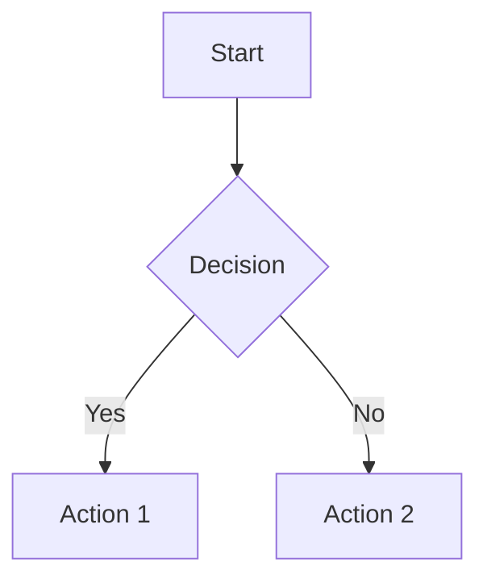

# Contributing to WaveMaker Documentation

Thank you for your interest in contributing to WaveMaker Documentation! This guide will help you understand our workflow, conventions, and best practices.

## Table of Contents

- [Getting Started](#getting-started)
- [Content Guidelines](#content-guidelines)
- [File Organization](#file-organization)
- [Writing Guidelines](#writing-guidelines)
- [Using the CLI Tool](#using-the-cli-tool)
- [Common Tasks](#common-tasks)
- [Review Process](#review-process)
- [Style Guide](#style-guide)
- [Best Practices](#best-practices)

## Getting Started

### Prerequisites

- **Node.js** >= 20.0
- **Git** with GitHub account
- **Code Editor** (VS Code recommended)
- Basic knowledge of [Markdown](https://guides.github.com/features/mastering-markdown/)
- Familiarity with [MDX](https://mdxjs.com/) (Markdown + JSX)

### Setup

1. **Clone the repository**
   ```bash
   # Option 1: Clone directly (for WaveMaker organization members)
   git clone https://github.com/wavemaker/docs.git
   cd docs
   
   # Option 2: Fork and clone (for external contributors)
   # Go to https://github.com/wavemaker/docs and click "Fork"
   # Then clone your fork:
   # git clone https://github.com/YOUR_USERNAME/docs.git
   # cd docs
   ```
2. **Install dependencies**
   ```bash
   npm install
   ```

3. **Start development server**
   ```bash
   npm start
   ```

4. **Create a feature branch**
   ```bash
   git checkout -b feature/your-feature-name
   ```

## Content Guidelines

### File Types

- **`.md`** - Standard Markdown files
- **`.mdx`** - Markdown with JSX components (preferred)

### Frontmatter

Every documentation file should include frontmatter:

```yaml
---
last_update: { author: "Author Name" }
tags: [tag1, tag2]           # Optional
---
```

### Content Structure

```markdown
---
last_update: { author: "Author Name" }
---

# Overview

Brief introduction to the topic.

## Prerequisites

What users need before starting.

## Basic Usage

Step-by-step instructions.

## Advanced Features

More complex scenarios.

## Examples

Practical examples with code snippets.

## Troubleshooting

Common issues and solutions.

## Related Topics

Links to related documentation.
```

## File Organization

### Directory Structure

```
docs/
├── apis-and-services/       # Backend APIs and services
├── user-interfaces/         # UI components and frameworks
│   ├── web/                # Web-specific documentation
│   └── mobile/             # Mobile-specific documentation
├── studio/                 # WaveMaker Studio documentation
├── build-and-deploy/       # Deployment guides
├── design-system/          # Design system documentation
└── guide/                  # General guides and tutorials
```

### Naming Conventions

- **Files**: Use kebab-case: `my-component.md`
- **Directories**: Use kebab-case: `user-interfaces/`
- **Images**: Use descriptive names: `login-form-example.png`

### Asset Organization

```
static/
├── img/
│   ├── component-icons/    # Component icons
│   ├── blogs/             # Blog post images
│   └── section-img/       # Section-specific images
└── learn/
    └── assets/            # Documentation assets
```

## Writing Guidelines

### Tone and Style

- **Clear and concise**: Use simple, direct language
- **User-focused**: Write from the user's perspective
- **Action-oriented**: Use active voice and imperative mood
- **Consistent**: Follow established patterns and terminology

### Formatting

#### Headers

```markdown
# Page Title (H1 - only one per page)
## Main Section (H2)
### Subsection (H3)
#### Details (H4)
```

#### Code Blocks

````markdown
```javascript title="example.js"
const example = {
  property: 'value'
};
```
````

#### Callouts

```markdown
:::note
This is a note callout.
:::

:::tip
This is a tip callout.
:::

:::warning
This is a warning callout.
:::

:::danger
This is a danger callout.
:::
```

#### Links

```markdown
<!-- Internal links -->
[Link text](./relative-path.md)
[Link text](../other-section/page.md)

<!-- External links -->
[External link](https://example.com)
```

#### Images

```markdown


<!-- With custom sizing -->

```

### Diagrams

Use Mermaid for diagrams:

````markdown

````

## Using the CLI Tool

Our documentation manager CLI tool helps maintain consistency:

```bash
npm run manage-docs
```

### Available Options

1. **Create a new sidebar** - Sets up a new documentation section
2. **Create a new category** - Adds a category to an existing sidebar
3. **Create a new doc** - Creates a new documentation page
4. **Rollback and Exit** - Undoes all changes from the current session

### CLI Workflow

1. Run `npm run manage-docs`
2. Select your desired action
3. Follow the interactive prompts
4. The tool will:
   - Create necessary files and directories
   - Update sidebar configurations
   - Apply consistent formatting
   - Maintain proper file organization

## Common Tasks

### Adding a New Documentation Page

#### Method 1: Using CLI Tool (Recommended)

```bash
npm run manage-docs
# Select "Create a new doc"
# Follow the prompts
```

#### Method 2: Manual Creation

1. **Create the file**
   ```bash
   # Example: docs/user-interfaces/web/new-component.mdx
   ```

2. **Add frontmatter and content**
   ```markdown
   ---
   title: "New Component"
   ---
   
   # New Component
   
   Component description and usage.
   ```

3. **Update sidebar configuration**
   ```javascript
   // In sidebar/sidebars/userInterfacesWebSidebar.js
   {
     type: 'doc',
     id: 'user-interfaces/web/new-component',
     label: 'New Component'
   }
   ```

### Adding a Blog Post

1. **Create the file**
   ```bash
   # Format: YYYY-MM-DD-title.md
   touch blogs/blog/2024-01-20-new-feature.md
   ```

2. **Add frontmatter**
   ```markdown
   ---
   title: "Introducing New Feature"
   authors: [author-key]
   tags: [feature, announcement]
   ---
   
   Brief summary of the post...
   
   <!--truncate-->
   
   Full blog content here...
   ```

3. **Update authors.yml** (if needed)
   ```yaml
   author-key:
     name: Author Name
     title: Position
     url: https://github.com/username
     image_url: https://github.com/username.png
   ```

### Adding Images

1. **Place images in appropriate directory**
   ```
   static/img/section-name/image-name.png
   ```

2. **Reference in documentation**
   ```markdown
   
   ```

### Creating a New Sidebar

1. **Use CLI tool**
   ```bash
   npm run manage-docs
   # Select "Create a new sidebar"
   ```

2. **Or manually create**
   ```javascript
   // sidebar/sidebars/newSidebar.js
   export default [
     {
       type: 'doc',
       id: 'new-section/overview',
       label: 'Overview'
     }
   ];
   ```

3. **Update main sidebar file**
   ```javascript
   // sidebar/sidebars.js
   import newSidebar from './sidebars/newSidebar';
   
   const sidebars = {
     // ... existing sidebars
     newSidebar,
   };
   ```

## Review Process

### Before Submitting

1. **Test locally**
   ```bash
   npm start
   # Verify your changes work correctly
   ```

2. **Check for broken links**
   ```bash
   npm run build
   # Fix any broken links or references
   ```

3. **Format code**
   ```bash
   npx prettier --write "**/*.{md,mdx,js,json}"
   ```

### Pull Request Guidelines

1. **Create descriptive title**
   - ✅ "Add authentication guide for REST APIs"
   - ❌ "Update docs"

2. **Include description**
   - What changes were made
   - Why the changes were necessary
   - Any breaking changes or considerations

3. **Link related issues**
   ```markdown
   Closes #123
   Related to #456
   ```

4. **Request appropriate reviewers**
   - Technical reviewers for accuracy
   - Content reviewers for clarity

### Review Checklist

- [ ] Content is accurate and up-to-date
- [ ] Writing follows style guidelines
- [ ] Links work correctly
- [ ] Images display properly
- [ ] Code examples are functional
- [ ] Sidebar navigation is correct
- [ ] No spelling or grammar errors

## Style Guide

### Language and Tone

- **Use active voice**: "Click the button" not "The button should be clicked"
- **Be direct**: "Configure the settings" not "You might want to configure the settings"
- **Use present tense**: "The system creates" not "The system will create"
- **Avoid jargon**: Explain technical terms when first used

### Formatting Standards

#### Lists

```markdown
<!-- Ordered lists for steps -->
1. First step
2. Second step
3. Third step

<!-- Unordered lists for options -->
- Option A
- Option B
- Option C
```

#### Code References

```markdown
<!-- Inline code -->
Use the `className` property to style components.

<!-- File paths -->
Navigate to `src/components/Button.jsx`.

<!-- UI elements -->
Click the **Save** button.
```

#### Capitalization

- **Sentence case for headings**: "Getting started with components"
- **Title case for proper nouns**: "WaveMaker Studio"
- **Consistent terminology**: Use the same terms throughout

### Content Organization

#### Page Structure

1. **Overview** - What this page covers
2. **Prerequisites** - What users need first
3. **Main content** - Step-by-step instructions
4. **Examples** - Practical demonstrations
5. **Troubleshooting** - Common issues
6. **Related topics** - Links to related content

#### Information Hierarchy

- Use headings to create clear structure
- Keep sections focused and concise
- Use callouts for important information
- Include code examples where helpful

## Best Practices

### Content Creation

1. **Start with user needs**
   - What problem does this solve?
   - What does the user want to accomplish?

2. **Provide context**
   - Explain why something is important
   - Show how it fits into the bigger picture

3. **Include examples**
   - Real-world scenarios
   - Complete, working code samples
   - Screenshots when helpful

4. **Test your instructions**
   - Follow your own steps
   - Verify all links and references
   - Check on different devices/browsers

### Maintenance

1. **Keep content current**
   - Update for new features
   - Remove outdated information
   - Verify links regularly

2. **Monitor feedback**
   - Address user questions
   - Improve unclear sections
   - Add missing information

3. **Collaborate effectively**
   - Communicate with team members
   - Share knowledge and insights
   - Review others' contributions

### Performance

1. **Optimize images**
   - Use appropriate file formats
   - Compress images for web
   - Include alt text for accessibility

2. **Minimize bundle size**
   - Avoid large embedded assets
   - Use external links for large files
   - Optimize code examples

## Tools and Resources

### Recommended Tools

- **Editor**: [VS Code](https://code.visualstudio.com/) with Markdown extensions
- **Image editing**: [GIMP](https://www.gimp.org/) or [Figma](https://figma.com/)
- **Diagrams**: [Mermaid Live Editor](https://mermaid.live/)
- **Screenshots**: [Snagit](https://www.techsmith.com/screen-capture.html) or built-in tools

### Useful Extensions (VS Code)

- Markdown All in One
- MDX
- Prettier - Code formatter
- GitLens
- Spell Right

### References

- [Docusaurus Documentation](https://docusaurus.io/docs)
- [MDX Documentation](https://mdxjs.com/docs/)
- [Mermaid Documentation](https://mermaid.js.org/)
- [Markdown Guide](https://www.markdownguide.org/)

## Getting Help

### Questions and Support

- **GitHub Issues**: For bugs and feature requests
- **GitHub Discussions**: For questions and general discussion
- **Team Chat**: Internal communication channels
- **Documentation**: This guide and Docusaurus docs

### Reporting Issues

When reporting issues, include:

1. **Clear description** of the problem
2. **Steps to reproduce** the issue
3. **Expected vs actual behavior**
4. **Environment details** (browser, OS, etc.)
5. **Screenshots** if applicable

---

Thank you for contributing to WaveMaker Documentation! Your efforts help make our platform more accessible and user-friendly for everyone.