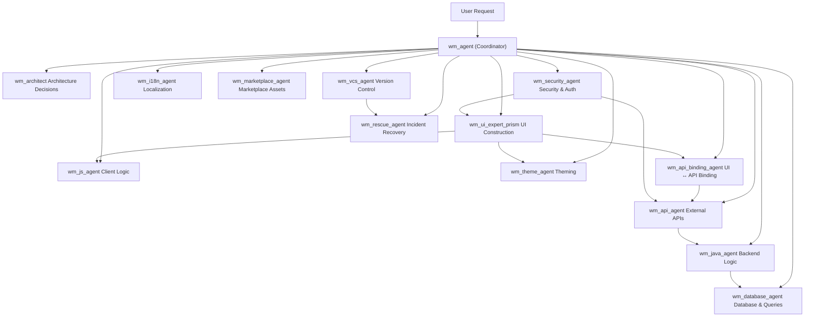

### Architecture Diagram



AIRA follows a controlled, step-by-step execution flow. Each step limits scope to prevent unintended changes.

### User Request

You give a natural-language instruction that describes what you want to build.

**Example**

```
Add a login page with email and password, connect it to an authentication API,
and restrict access to authenticated users.
```

### Intent Analysis

The WaveMaker Agent analyzes the request. It:

- Understands the required outcome  
- Identifies involved domains (UI, API, Security)  
- Breaks the request into smaller executable tasks  
- Checks that available agents can handle the request  

No code or configuration is created at this stage.

### Task Delegation

The system assigns each task to a specialized agent.

**Example**

```
- UI Expert Agent → Creates or updates the login page UI  
- API Agent → Imports or binds the authentication API  
- Security Agent → Applies authentication and access rules  
```

Each agent works only within its defined scope.

### Controlled Execution

Each agent:
- Modifies only authorized files and entities  
- Follows WaveMaker project rules and structure  
- Reports results back to the WaveMaker Agent  

This keeps changes predictable and safe.

### Assembly and Completion

The WaveMaker Agent:
- Collects outputs from all agents  
- Resolves dependencies between changes  
- Prepares a final set of changes for review  

Changes apply to the design workspace only after acceptance.

### Execution Outcome

You get a complete, working feature.  
Changes stay scoped, reviewable, and under developer control.

## Controlling AI Agents


### The plan is your control point

AIRA shows every step it plans to run before it does anything. This is the moment where you stay in charge. You can review the steps, make edits, or ask AIRA to adjust the plan. You do not need to read every line in detail, but you should scan for what pages it will modify, which files it will touch, any API or service updates, and new components it plans to add.

If something looks wrong, you can correct it in plain language. You can ask AIRA to remove a step, avoid a specific service, limit changes to the UI, or split the work into smaller parts. AIRA updates the plan and shows it again for review.

### Once you approve the plan, execution runs to completion

After you confirm the plan, you cannot stop, pause, or modify it. This is by design. Your real control happens before execution, when the full breakdown is visible and editable.

### If you did not read everything closely

Nothing breaks automatically, but you might approve changes you did not intend. To reduce that risk, you can ask AIRA to simplify the plan. You can request only UI-related steps, group similar actions, explain only risky changes, or highlight the files being modified. This lets you review faster without missing important details.

### If something still goes wrong

You always have a way out. You can undo changes using version control, reject all changes during the Apply step, or start a fresh chat with clearer instructions.
