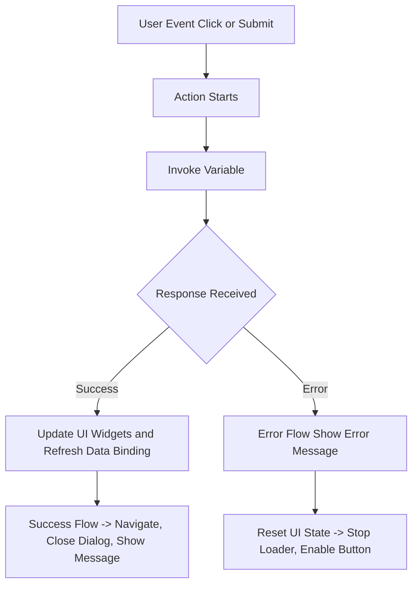
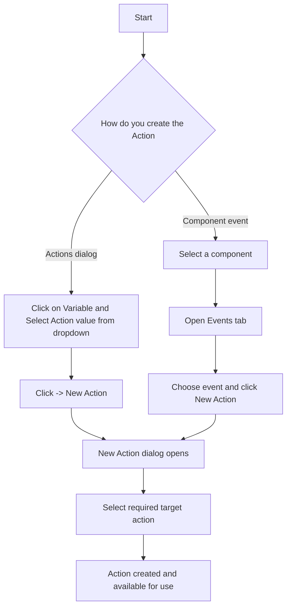

# Overview

## Actions in WaveMaker

In WaveMaker, Variables and Actions together form the integration layer between the user interface and backend services. While variables are mainly used for data operations (fetching, inserting, updating, deleting, and binding data to widgets), Actions define what the application should do next when something happens.

Actions help you connect UI events (like button clicks) with application logic (like invoking a service, validating data, or navigating to another page), without tightly coupling everything to a single widget.

Actions represent operations performed by the application when an event occurs. These operations can be triggered by:
- User-initiated events (such as clicking a button or submitting a form)
- System-driven events (such as successful completion of a service call)
Actions enable developers to implement business logic, rules, and navigation flows without tightly coupling them to UI components.

## Action Creation

There are two common ways to create an Action:

- From the Actions dialog: You can open the Actions panel and click New Action to create an action directly.
- From a component event: When you select a UI component (like a Button, Form, or DataTable), you can go to its Events tab and choose New Action for an event such as onClick, onSubmit, or onRowSelect

