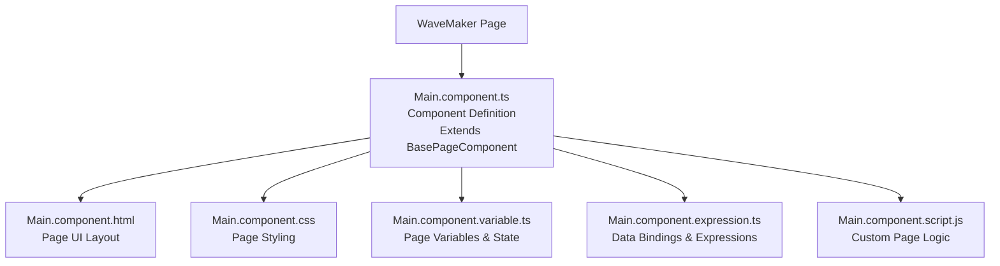

# Working with Generated Angular Code

WaveMaker allows applications to be exported as a standard Angular project, producing a complete frontend codebase that follows Angular CLI conventions while preserving WaveMaker’s runtime, bindings, and page composition model. The generated code aligns with Angular best practices and is structured to be modular, maintainable, and production ready, while accurately reflecting the UI, logic, and data bindings defined in WaveMaker Studio.
Key characteristics of the generated Angular code include:
    - **Component Based Structure**: Each page is generated as an Angular component with a clearly defined scope, promoting modularity and separation of concerns. This makes individual pages easier to maintain, test, and evolve without impacting unrelated parts of the application.
    - **Security & Performance Optimizations**: The generated setup incorporates standard Angular build optimizations such as route guards for access control, tree-shaking to remove unused code, and minification for smaller bundle sizes. Together, these practices help keep the application secure, fast, and production ready.
    - **Custom Extensions & Integrations**: The project structure allows teams to extend generated components with custom logic and integrate third party Angular components and libraries, enabling advanced UI patterns and feature enhancements without disrupting the generated core.
    - **Deployment Friendly Frontend Output**: The compiled frontend output is suitable for deployment as static assets, making it straightforward to host on web servers or CDNs as part of standard frontend deployment pipelines.

The exported project is organized into three main layers:
    - **Export workflow:** how the Angular ZIP is generated and downloaded
    - **Project structure:** how the Angular application is organized at a high level
    - **Page structure:** how each WaveMaker page is represented as an Angular component

### Steps to Export a WaveMaker Project as Angular ZIP

- **Open your project in WaveMaker Studio** Make sure the project you want to export is loaded and ready.
- **Click on “Export Project”** This opens the export options menu.
- **Select “Project as Angular ZIP”** Choose the option to export your application as an Angular source bundle.
- **Confirm the Export Job** A dialog appears saying the export job has been created (Click OK to proceed)
- **Open Project Notifications** Click the Project Notification icon to view background jobs.
- **Navigate to the Jobs Tab** In the popup, go to the Jobs tab to see export progress.
- **Find the Export Job** Locate the job related to “Angular ZIP export”.
- **Download the Angular ZIP** Click the Download button for the completed job.

--- 
### Understanding the WaveMaker Angular Project Structure 

When you export a WaveMaker app as an Angular ZIP, you get a standard Angular CLI project with WaveMaker-specific runtime and build layers on top. 

Think of it as: **Angular app + WaveMaker runtime + generated pages + service bindings**

```javascript
angular_app/
├── angular.json // Angular CLI configuration (build, serve, assets, styles)
├── package.json // NPM dependencies + scripts
├── package-lock.json // Locked dependency versions
├── tsconfig.json // Base TypeScript configuration
├── proxy.conf.js // Dev-time backend proxy (avoids CORS during local run)
├── wm-custom-webpack.config.js // Wavemaker webpack extensions (rarely edited manually)
│
├── build-scripts/
│   ├── build.js // Custom build logic used by Wavemaker
│   ├── index-html-transform.js // Injects scripts/styles during build
│   └── index-html-transform-ng-serve.ts // Same as above but for ng serve
│
├── src/
│   ├── index.html // Main HTML shell for the Angular app
│   ├── main.ts // Angular bootstrap entry point
│   ├── polyfills.ts // Browser compatibility polyfills
│   ├── styles.css // Global styles (themes usually injected by WM)
│   ├── environment.ts // Environment configuration (URLs, flags)
│   │
│   ├── app/
│   │   ├── app.component.ts / html / css   // Root Angular component
│   │   ├── app.routes.ts // Central routing config (Mostly Wavemaker generated)
│   │   ├── app.config.ts // App-level configuration and providers
│   │   ├── wm-project-properties.ts // Project metadata generated by Wavemaker 
│   │   ├── wmProperties.js // Runtime project settings (do not edit)
│   │   ├── lazy-load-scripts.resolve.ts // Handles lazy loading of scripts/components
│   │   │
│   │   ├── extensions/
│   │   │   └── formatters.js // Custom value formatters (SAFE to extend)
│   │   │
│   │   ├── pages/
│   │   │   ├── Login/
│   │   │   │   ├── Login.component.ts // Page component logic
│   │   │   │   ├── Login.component.html // Page UI layout
│   │   │   │   ├── Login.component.css // Page-specific styles
│   │   │   │   ├── Login.component.variables.ts // Page variables / state (WM-managed)
│   │   │   │   ├── Login.component.expressions.ts // Auto-generated data bindings
│   │   │   │   └── Login.component.script.js // Custom JS logic (SAFE for manual logic)
│   │   │   
│   │   └── prefabs/
│   │       └── prefab-config.ts // Configuration for reusable prefabs
│   │
│   ├── framework/
│   │   ├── services/
│   │   │   ├── app-extension.service.ts
│   │   │   ├── app-js-provider.service.ts
│   │   │   ├── app-variables-provider.service.ts
│   │   │   ├── component-ref-provider.service.ts
│   │   │   ├── lazy-component-ref-provider.service.ts
│   │   │   └── prefab-config-provider.service.ts //  Wavemaker runtime services (DO NOT MODIFY)
│   │   │
│   │   └── util/
│   │       ├── lazy-module-routes.ts
│   │       └── page-util.ts // Internal navigation/helpers
│   │
│   └── servicedefs/
│       └── app-servicedefs.json // Backend API definitions used by WM

```

---

### WaveMaker Page Component Structure

In a WaveMaker Angular export, each WaveMaker page is generated as a standalone Angular component.
All the UI, logic, state, and bindings for a page are split across multiple files to separate concerns and make customization safer.

#### Files Generated for Each WaveMaker Page
Each wavemaker page (for example: **Main/**) contains the following files:
    - **Main.component.html** Contains the HTML template for the page (All WaveMaker components and layout definitions are rendered here)
    - **Main.component.css** Holds page specific styles
    - **Main.component.script.js** Intended for developer written JavaScript logic
    - **Main.component.ts** Declares the Angular component for the page (Wires together template, styles, variables, and expressions)
    - **Main.component.variable.ts** Contains all WaveMaker generated page variables
    - **Main.component.expression.ts** Contains auto generated expression logic  (🚫 Do not edit manually)

This modular structure helps keep presentation, behavior, expressions, and state management cleanly organized.




#### Generated Angular Markup of WaveMaker Page
```html
    <div wmPage #wm_page4="wmPage" data-role="pageContainer" [attr.aria-label]="wm_page4.arialabel"  name="page" pagetitle="User Details">
        <header wmHeader #wm_header3="wmHeader" partialContainer data-role="page-header" role="banner" [attr.aria-label]="wm_header3.arialabel || 'Page header'"  content="header" name="header"></header>
        <main wmContent data-role="page-content" role="main"  name="content">
            <aside wmLeftPanel #wm_left_panel3="wmLeftPanel" partialContainer data-role="page-left-panel" [attr.aria-label]="wm_left_panel3.arialabel || 'Left navigation panel'" wmSmoothscroll="false"  columnwidth="2" content="leftnav" name="leftpanel"></aside>
            <div wmPageContent  wmSmoothscroll="false"  columnwidth="10" name="pagecontent"><ng-container >@if (compilePageContent) {{{onPageContentReady()}}}</ng-container></div>
        </main>
        <footer wmFooter #wm_footer3="wmFooter" partialContainer data-role="page-footer" role="contentinfo" [attr.aria-label]="wm_footer3.arialabel || 'Page footer'"  content="footer" name="footer"></footer>
    </div>
```


