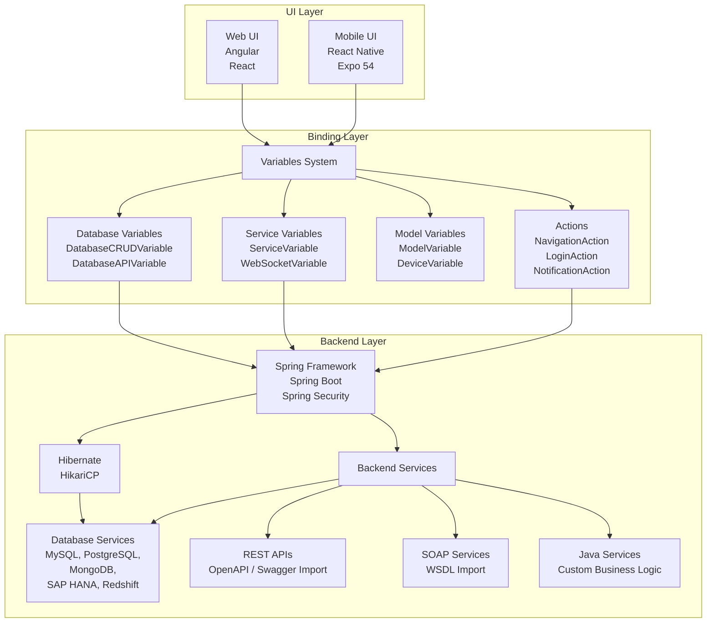

# Overview

WaveMaker projects follow a standard Maven structure with added directories for Angular web apps and mobile apps. The project is Maven-compliant, inherits from a parent POM, and can generate separate frontend/backend artifacts or a combined WAR. For mobile, React Native projects are generated with a standard Expo-based structure.

### Core Structure
    - Maven-based with parent POM inheritance: wavemaker-app-parent → wavemaker-app-dependencies → your app’s pom.xml 
    - Default profiles: development and deployment; custom profiles supported
    - Build outputs:
        - Combined WAR (frontend + backend) by default
        - Separate ui-artifacts.zip (Angular) + project.war when build.ui.mode=angular
        - Separate Project as Angular zip 
        - Separate Project as React zip


```text 
project/
├── src/main/
│   ├── java/          # Java service classes
│   ├── resources/     # Configuration files, queries
│   └── webapp/        # Web application root
│       ├── pages/     # Page markup, scripts, styles
│       ├── services/  # Backend service metadata
│       ├── app.css    # Application-level styles
│       ├── app.js     # Application-level scripts
│       └── app.variables.json  # Application variables
├── pom.xml            # Maven build configuration
├── package.json       # NPM dependencies
└── profiles/          # Environment-specific configurations
```

### Three-Layer Application Architecture

WaveMaker applications follow a strict three-layer architecture that separates concerns between presentation, data binding, and business logic.



