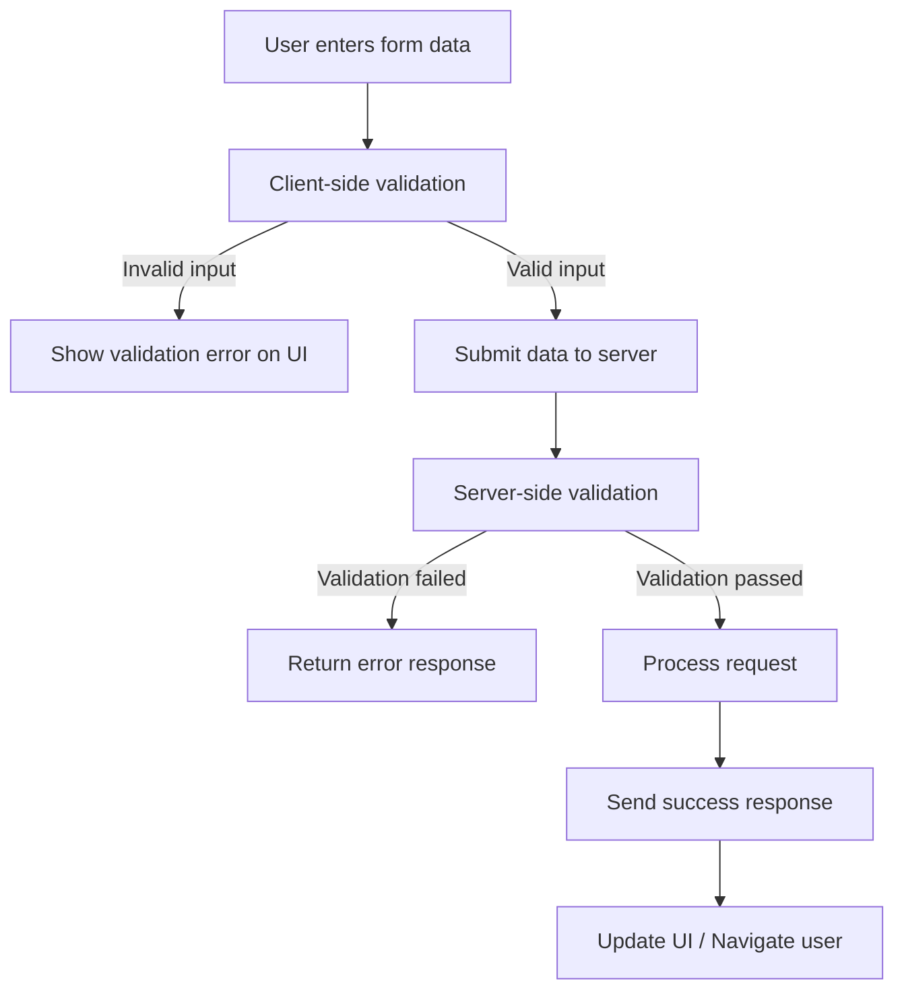
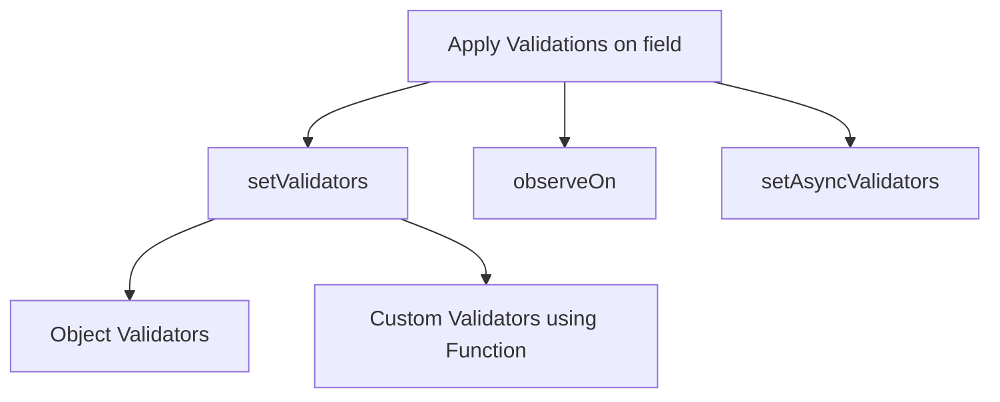

# Validation Flow in an Application

Validation is a standard feature in modern web and mobile applications. Whenever users fill out a form, the application guides them by immediately pointing out missing or incorrect input. For instance, when a mandatory field is left empty, the UI clearly informs the user with messages such as:

- “**This field is required**” — indicating that the input must be provided before proceeding
- “**Phone number must be in xxx-xxxx format**” — the data must follow a pattern
- “**Password must include a number, symbol, and uppercase letter**” — specific rules must be met

This is called **Validation**. When you enter data, the browser will check that the data is in the correct format and within the constraints set by the application. Validation done in the browser is called **client-side validation**, while validation done on the server is called **server-side validation**



## How Validation Is Achieved in WaveMaker
WaveMaker provides built in validation capabilities that allow developers to define rules, enforce data correctness, and guide users while entering information, without writing extensive custom code. Validation in WaveMaker is primarily handled at the UI layer using Validator Functions, which can be applied to Forms, DataTables, and individual input fields.

When creating a Form or DataTable, you can configure Validator Functions to define validation rules for the associated fields. These validators determine what values are allowed, when an error should be shown, and what message is displayed to the user. Using Validator Functions, you can apply validations to a single field or multiple fields using methods


### Validator Types:
```VALIDATOR``` contains the default validators which can be accessed using the following validator types.

| Validator     | Validator Type            |
|---------------|---------------------------|
| required      | VALIDATOR.REQUIRED        |
| maxchars      | VALIDATOR.MAXCHARS        |
| minvalue      | VALIDATOR.MINVALUE        |
| maxvalue      | VALIDATOR.MAXVALUE        |
| regexp        | VALIDATOR.REGEXP          |
| mindate       | VALIDATOR.MINDATE         |
| maxdate       | VALIDATOR.MAXDATE         |
| excludedates  | VALIDATOR.EXCLUDEDATES    |
| excludedays   | VALIDATOR.EXCLUDEDAYS     |
| mintime       | VALIDATOR.MINTIME         |
| maxtime       | VALIDATOR.MAXTIME         |

#### There are three ways to apply Validations on a field as below 




### setValidators
WaveMaker provides validators which can be referenced and used in the setValidator method for setting default validations for Form/DataTable fields. This method accepts an array of:

- Objects for default validators
- Functions for custom validation

#### Object Validators
These validations also include default validators like required, min value, max value, and more. To apply required validation, follow the steps below:

    #### Form
    ```javascript
        var VALIDATOR = App.getDependency('CONSTANTS').VALIDATOR;
        Page.Widgets.formName.formfields.fieldName.setValidators([{
            type: VALIDATOR.REQUIRED,
            validator: true,
            // Display error message for the form field
            errorMessage: "This field cannot be empty."
        }]);
    ```

    #### DataTable
    ```javascript
        var VALIDATOR = App.getDependency('CONSTANTS').VALIDATOR;
        Page.Widgets.tableName.columns.columnName.setValidators([{
            type: VALIDATOR.REQUIRED,
            validator: true,
            // Display error message for the table column field
            errorMessage: "This field cannot be empty."
        }]);
    ```

#### Custom Validators using Functions
These validations can contain custom validations. Follow the steps below to add customizations to the form/table field.

   
    ```javascript
        // Form
        Page.Widgets.formName.formfields.fieldName.setValidators([lastNameVal]);

        // DataTable
        Page.Widgets.tableName.columns.columnName.setValidators([lastNameVal]);

        function lastNameVal(field, form) {
            if (field.value && field.value.length < 2) {
                return {
                    errorMessage: "Enter your full name."
                };
            }
        }
    ```

#### Example using Objects and Custom Validator Functions

In the following example, Form/DataTable EmployeeForm has multiple validations, including email, it should validate regular expression REGEXP and should not be empty.

    ```javascript
        // Form
        Page.Widgets.EmployeeForm.formfields.email.setValidators([emailRequired, {
            type: VALIDATOR.REGEXP,
            validator: /\w+@\w+\.\w{2,3}/,
            errorMessage: "Not a Valid Email"
        }]);

        // DataTable
        Page.Widgets.EmployeeTable.columns.email.setValidators([emailRequired, {
            type: VALIDATOR.REGEXP,
            validator: /\w+@\w+\.\w{2,3}/,
            errorMessage: "Not a Valid Email"
        }]);

        function emailRequired(field, table) {
            if (field.value && field.value.length < 1) {
                return {
                    errorMessage: "Email cannot be empty."
                };
            }
        }
    ```

### observeOn
This validation type observes changes in two or more fields. This method accepts an array of field names. Registering observeOn on a field triggers the field validations whenever there are changes in the observing field values. For example, it notifies whenever there are changes in any of the fields specified in the array.

#### Example for ObserveOn

In the following example, we are matching password and confirm password. Confirm password field depends on password field value. In the following lines of code, we are defining validator for confirmpassword field with confirmPasswordEval function which observes password form field.

    ```javascript
        // Form
        Page.Widgets.EmployeeForm.formfields.confirmpassword.setValidators([confirmFormPasswordEval]);
        Page.Widgets.EmployeeForm.formfields.confirmpassword.observeOn(['password']);

        function confirmFormPasswordEval(field, form) {
            let errorMessage = "Password & ConfirmPassword are not the same value"
            if (field.value && form.formfields.password.value != field.value) {
                return { errorMessage };
            }
        }

        // DataTable
        Page.Widgets.staticVariableTable.columns.confirmpassword.setValidators([confirmTablePasswordEval]);
        Page.Widgets.staticVariableTable.columns.confirmpassword.observeOn(['password']);

        function confirmTablePasswordEval(field, form) {
            let errorMessage = "Password & ConfirmPassword are not the same value"
            if(field.value && table.columns.password.value != field.value){
                return { errorMessage };
            }
        }
    ```

### setAsyncValidators
This method on the form field/table can be used to set async validations on the field. This method accepts an array of promises or function returning a promise.

#### Example for setAsyncValidators
In the following lines of code, we are setting async validation for email field by defining a function called emailAsync.

    ```javascript
        // Form
        Page.Widgets.employeeInfoForm.formfields.email.setAsyncValidators([emailAsync]);

        // DataTable
        Page.Widgets.employeeInfoTable.columns.email.setAsyncValidators([emailAsync]);

        function emailAsync(field, table) {
            if (field.value) {
                return new Promise(function(resolve, reject) {
                    var emailExists = Page.Variables.EmailData.dataSet.filter(function(data) {
                    if (data.dataValue === field.value) {
                        return true;
                    }
                });
                if (emailExists.length != 0) {
                    reject({
                        errorMessage: "The email address is already registered."
                    });
                }
                resolve();
                });
            }
        }
    ```