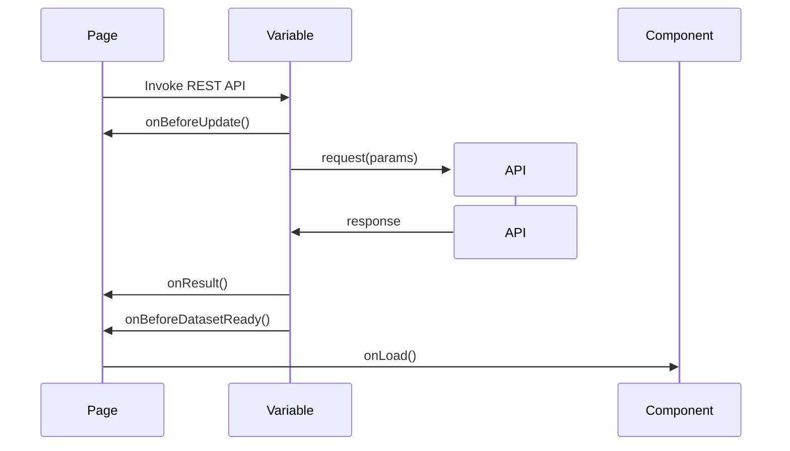

# Lifecycle and Events

Variables in WaveMaker act as configurable execution units that connect the UI with backend data and services. Their behavior is determined by execution lifecycle stages, Studio properties, and event hooks, allowing developers to manage when data is fetched, how it is processed, and how the UI responds.

---

## Variable Lifecycle

A variable moves through the following lifecycle stages during its execution in WaveMaker. Each stage represents a distinct phase where inputs are resolved, backend operations are performed, and results are processed and made available to the UI.
1. **Configuration**
   - Variable type, inputs, and target operation are defined in Studio
   - Event handlers are configured but not yet executed

2. **Invocation**
   - Variable execution is triggered through Auto Invoke, UI events, or chaining
   - Input bindings are resolved before execution

3. **Pre-Execution**
   - Variable-specific *On Before* events are executed
   - Inputs, filters, or request parameters can be modified

4. **Execution**
   - Backend operation is invoked (Database, API, Java, or Security service)
   - Execution is handled asynchronously by the WaveMaker runtime

5. **Post-Execution Processing**
   - Raw response is received
   - Dataset is processed and prepared for UI consumption

6. **Completion**
   - Success or error events are raised
   - Variable execution ends

---

## Variable Properties

Variable properties define how and when a variable executes, how much data it retrieves, and how it behaves at runtime. They control execution triggers, pagination and result limits, sorting and filtering, and concurrency handling. Proper configuration of these properties ensures predictable execution, optimal performance, and responsive UI behavior.

### Data Fetch Properties

| Property | Description |
|--------|-------------|
| **Records per Request** | Number of records fetched per backend request (default: 20) |
| **Design Max. Results** | Maximum number of records returned in Studio preview (default: 10) |
| **Order By** | Defines sorting order for the dataset (for example: `empId`) |
| **Select Fields** | Specifies which fields to retrieve from the backend |

### Execution Behavior Properties

| Property | Description |
|--------|-------------|
| **Update Data on Input Change** | Automatically refreshes data when input parameters change |
| **Request Data on Page Load** | Automatically executes the variable when the page loads |
| **In Flight Behavior** | Controls concurrent executions (e.g., `executeLast`) |

### UI Feedback Properties

| Property | Description |
|--------|-------------|
| **Spinner Context** | Defines where the loading spinner is displayed (e.g., Search Widgets) |
| **Spinner Message** | Custom message shown while the variable is executing |

### Filter Criteria

Filter criteria allow dynamic filtering of records before execution.

| Option | Description |
|------|-------------|
| **Filter Criteria Preview** | Displays the generated filter condition |

---

## Variable Events

WaveMaker exposes events at different points in the variable lifecycle. These events allow developers to intercept execution, modify inputs or results, and respond to success or failure scenarios. Event handlers provide fine-grained control over variable behavior without altering core logic.
### Pre-Execution Events

| Event | Description |
|------|-------------|
| **On Before List Records** | Allows modification of query filters, pagination, or search criteria before fetching records |
| **On Before Update** | Allows validation or modification of data before an update operation is executed |
| **On Can Update** | Determines whether an update operation is permitted based on custom conditions |

### Post-Execution Events

| Event | Description |
|------|-------------|
| **On Result** | Provides access to the raw response returned by the backend before processing |
| **On Dataset Ready** | Triggered when processed data is ready for UI binding and consumption |

### Completion Events

| Event | Description |
|------|-------------|
| **On Success** | Triggered when the variable execution completes successfully |
| **On Error** | Triggered when execution fails due to backend or runtime errors |

---

## Event Execution Order

For a typical data operation, events are executed in the following order:

 **Chained Variable Execution**

Variables can be chained to create a controlled execution sequence:
- A variable’s **onSuccess** event can trigger another variable
- Enables step-by-step workflows such as:
  - Fetch data → Process data → Update UI
  - Login → Fetch user profile → Load dashboard

---

## Summary

WaveMaker variables provide a structured and event-driven way to interact with data sources and services. Through a defined lifecycle, configurable properties, and well-placed events, variables enable precise control over execution flow, data handling, and UI updates. By leveraging event ordering and variable chaining, developers can build predictable, efficient, and maintainable application workflows.