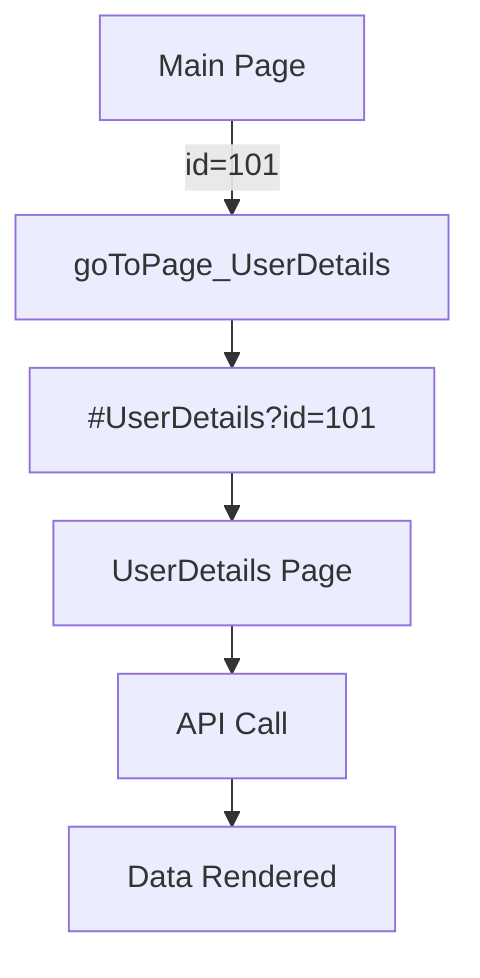

# Properties and Events
Page properties define how a page behaves, appears, and interacts with the application lifecycle. These settings control performance, data handling, and page-level configuration.

- Cache
- Refresh Data on Attach
- Page Title
- Page Params

### Cache
By default, when a user navigates away from a page, the page instance is destroyed to free up memory and resources. When **Cache** is enabled, the page instance is preserved in memory instead of being deleted. This allows the application to restore the page exactly as it was when the user navigates back, including UI state, variable values, and scroll position.

### Refresh Data on Attach
A property Refresh data on attach is added at the page level. If this flag is true, and the cached page instance is shown, then all start-up variables that have enabled load data on page startup of the page are invoked. If there are partials and prefabs in a page, then startup variables of partials and prefabs are also invoked. By default, this flag is set to true. 

You can use On Attach event to refresh data by invoking the required variables.

### Page Title
The Page Title defines the document title that is set in run mode. When the page is rendered, this value is applied as the browser’s document title (for example, shown in the browser tab or window title).

### Page Params
Pass data from one page to another page within an app by defining the Page Params. This applies to pages and partial pages. There can be many scenarios where you will need to pass data to a specific page.

#### How parameters work
A typical page URL for a given app would be like this:

```text
    https://www.wavemakerdocumentationapp.com/#pagename
```

Once the Page Params (**userId & existingUser**) has been defined the URL changes as below:

```text 
    https://www.wavemakerdocumentationapp.com/#/pagename?userId=1&existingUser=true 
```

This URL format will allow the data to be retained on browser refresh and reload. As is evident from the above example, multiple parameters are also supported.

#### Steps to adding Page Params
There are two aspects to adding Page Params.

- **Parameterized Page:** Page needing input to render the data on the page needs to define page-level parameters to hold this input and access the param value within the page.
- **Calling Page:** Page calling the above parameterized-page needs a way to pass the value to the parameter

#### Example 
UserDetails Page needs an id to render the data and it has to be invoked from Main Page with the needed value for id.

##### Parameterised Page
- From Page Properties panel, add the parameter fields to the parameterized page (in this case, UserDetails) by giving it a Name and specifying the Type. 


- Page Params are available on the page/partial scope and can be used in the same. These parameters can be accessed from the Page Param tab on the binding dialog.

##### Calling Page
- The Application-scoped Navigation Action generated by default by WaveMaker for UserDetails can be used to bind a value for the id field from the Main Page. The param will be available in the data tab of the Actions (goToPage_UserDetails). You can also create another Navigation Action and use it in a different navigation flow.


---

#### High-Level Flow

<div style={{ display: 'flex', justifyContent: 'center', margin: '2rem 0' }}>



</div>


### Events
WaveMaker provides lifecycle and system events at the page level, allowing you to execute custom logic when specific actions occur.

- **On Attach**: This event handler is called when the page instance from cache is attached to dom.
    ```JavaScript
        Page.onAttach = function ($event, widget) { 
            // Reset filter widgets to ensure a clean state
            Page.Widgets.orderFilter.reset();

            // Fetch the latest order data when the page becomes active again
            Page.Variables.GetOrders.invoke();
        };
    ```

- **On Detach**: This event handler is called when the page instance is detached from dom and saved in cache.
    ```JavaScript
        Page.onDetach = function ($event, widget) {
             // ex-1: Stop auto-refresh
            if (Page.dashboardRefreshTimer) {
                clearInterval(Page.dashboardRefreshTimer);
                Page.dashboardRefreshTimer = null;
            }
            
            // Clear page-specific cached data
            Page.Variables.selectedEmployee.setData(null);
            Page.Variables.filterCriteria.setData({});
        };
    ```
- **On Destroy**: This event handler is called when the page is destroyed.
    ```JavaScript
        Page.onDestroy = function ($event, widget) {
            // Remove custom event listeners
            window.removeEventListener("customEvent", Page.handleCustomEvent);
            
            // Clear local storage for page-specific entries
            localStorage.removeItem("tempOrderData");
        };
    ```
- **On Orientation Change**: This event handler is called when the screen orientation is changed (mobile/tablet).
    ```JavaScript
        Page.onOrientationChange = function ($event, widget, data) {
            if (event.matches) {
                Page.Widgets.sideMenu.show(); // Portrait layout
            } else {
                Page.Widgets.sideMenu.hide();  // Landscape layout
            }
        };
    ```
- **On Resize**: This event handler is called when the window is resized. 
    ```JavaScript
        Page.onResize = function (event, widget, data) {
            if (data.width < 768) {
                Page.Widgets.orderGrid.setProperty("columnMode", "stack"); // Smaller screen adjustments
            } else {
                Page.Widgets.orderGrid.setProperty("columnMode", "grid");  // Larger screen layout
            }
        };
    ```


